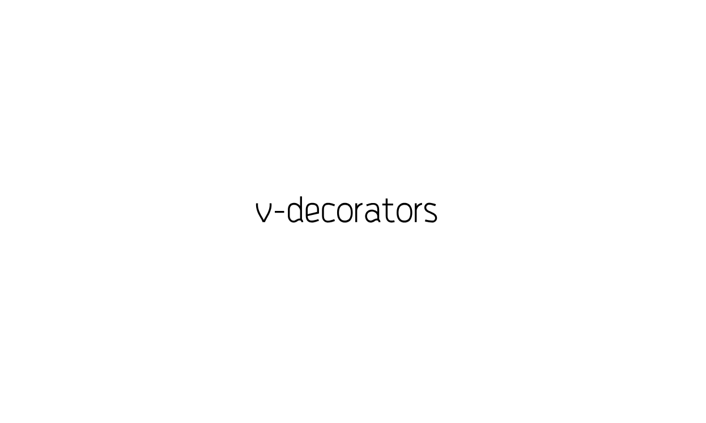

<p align="center" height="250">
  
</p>
<p align=center>
<a target="_blank" href="https://www.npmjs.com/package/v-decorators" title="NPM version"></a>
<a target="_blank" href="https://www.npmjs.com/package/v-decorators" title="Node version"></a>
<a target="_blank" href="https://opensource.org/licenses/MIT" title="License: MIT"></a>
<a target="_blank" href="https://travis-ci.org/DhyanaChina/v-decorators" title="Build Status"></a>
<a target="_blank" href="https://www.npmjs.com/package/v-decorators" title="Peer dependency "></a>
</p>

[English MD](README.md)

### 开始
#### 第一步: 确保可以在项目中使用装饰器

1. 在 `.babelrc` 文件中添加 `transform-decorators-legacy`: `"plugins": ["transform-decorators-legacy" ...`

2. `npm i babel-plugin-transform-decorators-legacy -D`

#### 第二部：下载和引入库

1. 在你的项目中安装 v-decorators, `npm i v-decorators`.

2. 在组件中引入, `import { Decorators } from 'v-decorators'`.

<br/>

### 文档

- @Decorators.AutoCatch(catchMode?: string)

    **参数：**
    - 无，默认。 效果与 'log' 相同。
    - 'error': 使用 `console.error` 打印捕获到的错误。
    - 'log': 使用 `console.log` 打印捕获到的错误。
    - 'slient': 捕获到的任何错误都不会显示。
    - `${functon_name}`: 指定一个函数名来处理捕获的错误，注意是函数名的字符串。如: AutoCatch('catchFunc')。

    **说明：**
    帮助你自动捕获 async 函数或 Promise 函数可能出现的错误, 使用时无需包裹在 `try ... catch` 中。

    使用前：
    ```
      methods: {
        async request() { try { await http(...) } catch(e) { ... } },
        clickHandle() { request().carch(...) }
      }
    ```
    使用后：
    ```
      methods: {
        @Decorators.AutoCatch()
        async request() { await http(...) },
        clickHandle() { request() }
      }
    ```

<br/>

- @Decorators.Debounce(time?: number)

    **参数：**
    - time: denounce time.

    **说明：**
    在指定的时间内，函数最多被触发一次。在过滤事件等场景下常用。


<br/>

- @Decorators.Throttle(wait: number = 300)

    **参数: **
    - wait: 等待时间

    **说明: **
    创建一个节流函数，在 wait 秒内最多执行 func 一次的函数。


<br/>

- @Decorators.Delay(time?: number)

    **参数：**
    - time: 延迟时间。

    **说明：**
    当前函数被调用时，延迟执行指定时间。（装饰器会帮你自动清理定时器）


<br/>

- @Decorators.Time()

    **参数：**
    - 无。

    **说明：**
    统计并在控制台显示当前函数执行时间, 如同 `console.time` 和 `console.timeEnd` 。


<br/>

- @Decorators.Shortcuts(obj: object)

    **参数：**
    - obj: 需要绑定的对象。

    **说明：**
    绑定一组数据到 vue 组件的实例上, **这不是响应式的数据**。这可以有效减少你的组件 data 对象的体积，通常用于绑定静态数据或函数。
    减少响应式数据可以有效提高组件的性能。

      示例：
      ```
      const MAX = '100', datePipe = (date) => { ... }
      // ...
      // 在组件中使用 Shortcuts 绑定数据

      <div>{{ max }} {{datePipe('2018/12/01')}}</div>

      @Decorators.Shortcuts({
        max: MAX, datePipe: datePipe,
      })
      data: () => ({
        your responsive datas...
      })
      ```

<br/>

- @Decorators.Deprecated(message?: string)

    **参数：**
    - message: 提示信息。

    **说明：**
    宣布一个函数即将被废弃，当函数被调用时将在控制台打印一条警告，你可以自定义警告的内容。

<br/>

- @Decorators.NextTick()

    **参数：** 无.

    **说明：**
    在 Vue.nextTick 内运行当前函数. 更多信息请参考: [Vue.nextTick](https://cn.vuejs.org/v2/api/#Vue-nextTick)

<br/>

### 示例

请看 [示例项目](https://github.com/v-decorators/tree/master/test)

<br/>

### LICENSE

[**MIT**](LICENSE)

